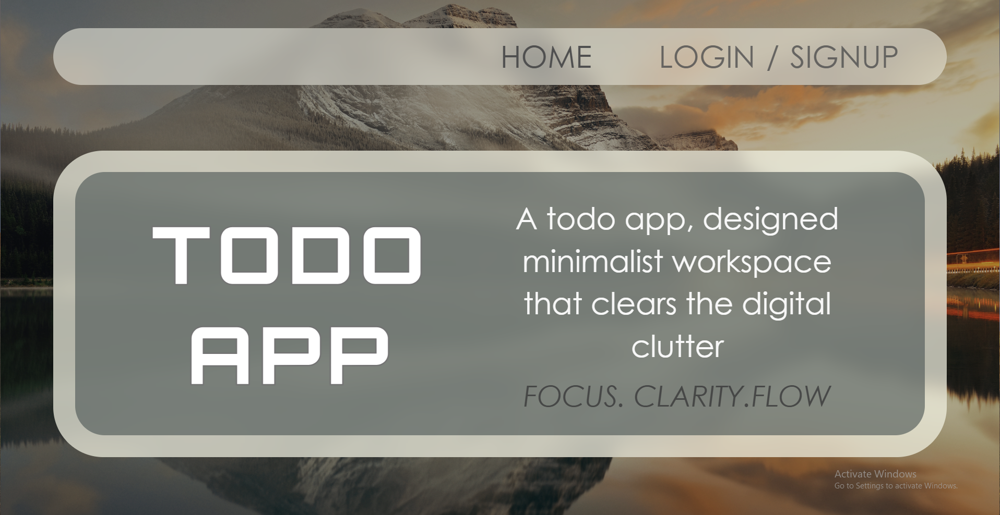
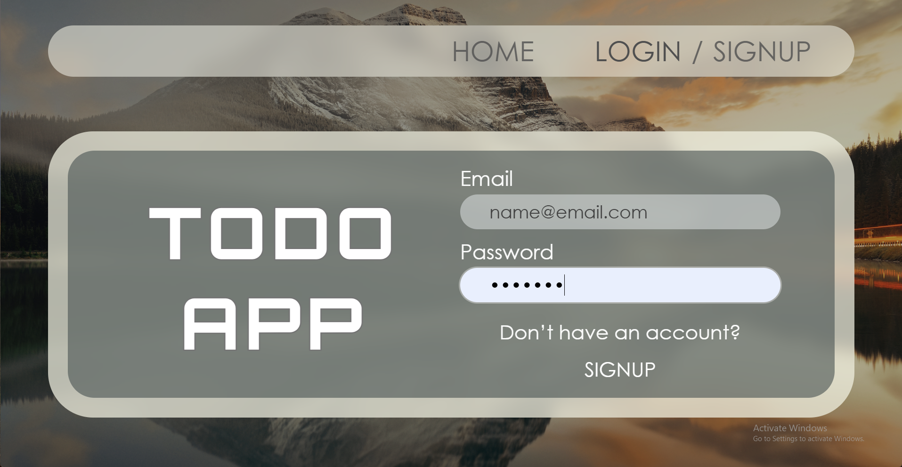
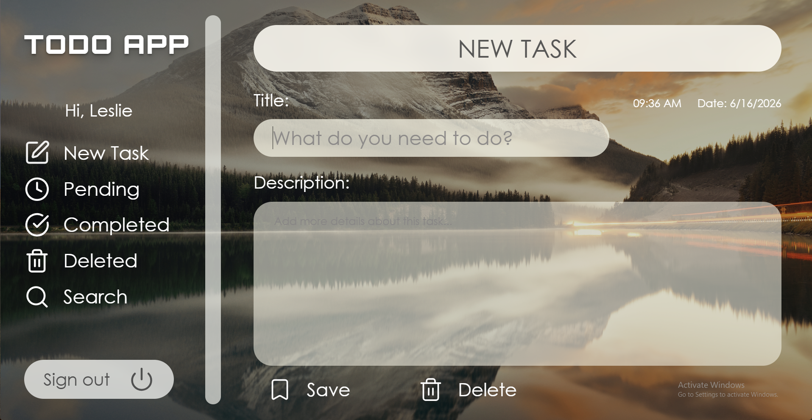
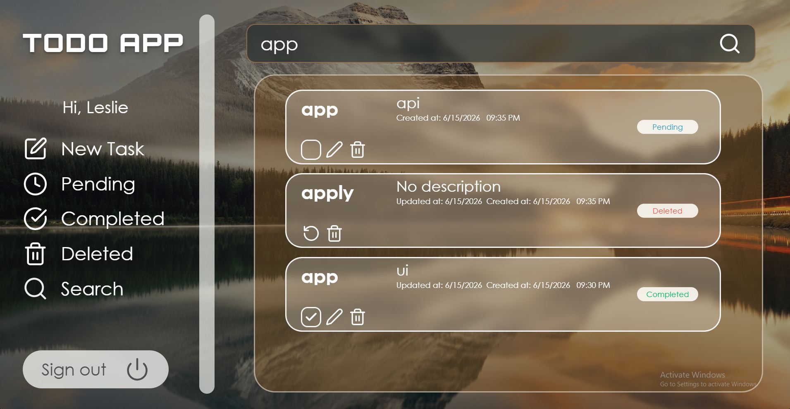

# Todo App

A full-stack todo app with authentication — React Router v7, Prisma + Neon, Tailwind CSS v4, TypeScript.

---

## Screenshots








---

## Features

- User registration and login
- Create, complete, and soft-delete todos
- Todos are private to each user

---

## Prerequisites

- [Bun](https://bun.sh) v1.3+
- A [Neon](https://neon.tech) account with a project and database created
- Node.js is **not** required — Bun handles everything

Install Bun if you don't have it:

```bash
# macOS / Linux
curl -fsSL https://bun.sh/install | bash

# Windows (PowerShell)
powershell -c "irm bun.sh/install.ps1 | iex"
```

---

## Setup

### 1. Clone and install

```bash
git clone <your-repo-url>
cd <project-folder>
bun install
```

### 2. Environment variables

Create a `.env` file in the project root:

```dotenv
DATABASE_URL="postgresql://<user>:<password>@<host>.neon.tech/<dbname>?sslmode=require"
SESSION_SECRET="your-session-secret"
NODE_ENV="development"
```

- `DATABASE_URL` — your Neon connection string (found in your Neon dashboard under **Connection Details**)
- `SESSION_SECRET` — any long random string used to sign session cookies
- `NODE_ENV` — set to `development` locally, `production` in deployment


### 3. Set up the database

```bash
bunx --bun prisma db push
bunx --bun prisma generate
```

### 4. Run the app

```bash
bun run dev
```

Visit [http://localhost:5173](http://localhost:5173).

---

## Scripts

| Command | Description |
|---|---|
| `bun run dev` | Development server with HMR |
| `bun run build` | Production build |
| `bun run start` | Serve production build |
| `bun run typecheck` | TypeScript check |

---

## Database Schema

Two models: `User` (id, email, username, password, todos) and `Todo` (id, title, description, completed, deleted, userId). Todos are soft-deleted via a `deleted` flag rather than removed from the database.

---

## Deployment Notes

- Set `NODE_ENV=production` in your hosting environment
- Add `DATABASE_URL` and `SESSION_SECRET` as environment variables in your host's dashboard
- Run `bunx --bun prisma migrate deploy` (not `dev`) in CI/CD before starting the server
- Build the app with `bun run build`, then serve with `bun run start`

---

## Troubleshooting

**Prisma Client missing** — run `bunx --bun prisma generate`.

**DATABASE_URL error on startup** — check your `.env` exists and the Neon URL includes `?sslmode=require`.

**Schema changes not reflected** — run `bunx --bun prisma db push` then `bunx --bun prisma generate` after editing `schema.prisma`.
